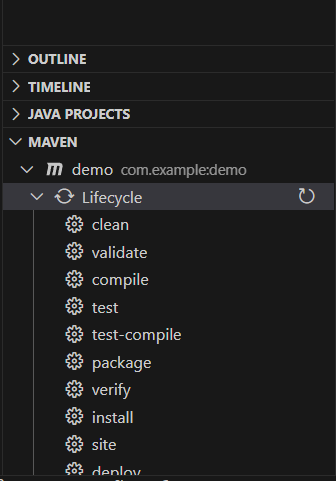

# Character frequency count problem in hadoop

### To run the job:

- Make sure that you are on `char-freq` directory
- Your hadoop is running fine
- Enter the following commands:
- If you don't have `input` dir in your create new one with following command:
  ```
  hadoop fs -mkdir /input
  ```
- Check if there is a file name input exist/created successfully:
  - **From browser**: Visit http://localhost:9870/explorer.html#/
  - **Using command line**:
    ```
    hadoop fs -ls /
    ```
    There you will find `/input` directory out there
- Put the `data-char-freq.txt` that contain our sample data for counting job to `input` directory using following command:
  ```
  hadoop fs -put data-char-freq.txt /input
  ```
- Check if the file uploaded there successfully or not:
  - **From browser**: Visit http://localhost:9870/explorer.html#/input
  - **Using command line**:
    ```
    hadoop fs -ls /input
    ```
    You will find a file name `data-char-freq.txt` there if you completed it successfully.
- Create the jar file using maven by running `clean` and then `install` then you will get the jar file inside the target directory of yours. For VSCode you will find the options here:  
  
- Now run the job with following command:

```
hadoop jar target/LetterCount-1.0-SNAPSHOT.jar com.lettercount.LetterCountRunner /input/data-char-freq.txt /char-freq-output
```

Then you will show some output in the terminal as follows:  
`2025-06-18 19:26:35,657 INFO mapreduce.Job:  map 0% reduce 0%  
2025-06-18 19:26:43,825 INFO mapreduce.Job:  map 100% reduce 0%  
2025-06-18 19:26:52,938 INFO mapreduce.Job:  map 100% reduce 100%  
2025-06-18 19:26:52,940 INFO mapreduce.Job: Job job_1750251958997_0001 completed successfully  `

- Now check the output:
  - **From browser**: Visit http://localhost:9870/explorer.html#/char-freq-output (check the part-r-00000 file)
  - **Using command line**:
    ```
    hadoop fs -cat /char-freq-output/part-r-00000
    ```
    There you can see the result there.
